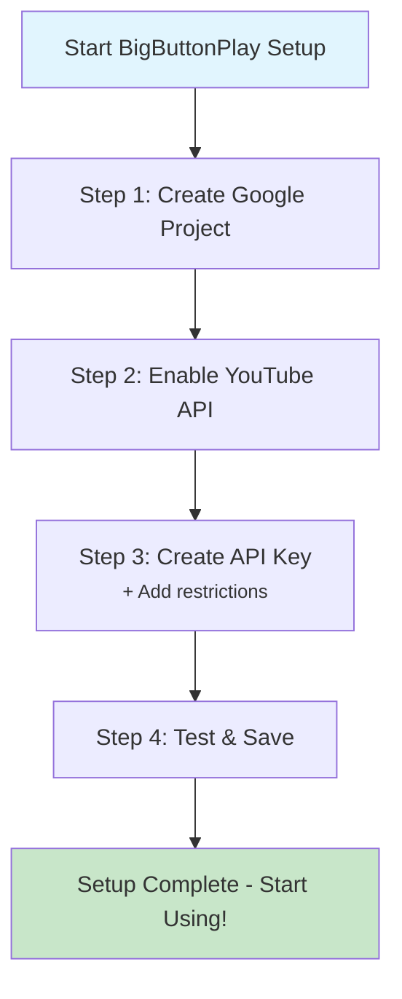

# BigButtonPlay

A simple, senior-friendly web application to interact with YouTube's API. 

**Designed specifically for older adults and users who are not comfortable with technology.** BigButtonPlay features only 2-3 large, clearly visible buttons to make using YouTube as simple as possible.

  
  
  
  

This is an **open-source, non-profit project** created to help bridge the digital divide and make technology more accessible to more people.

**🌐 Try it now:** [bigbuttonplay.com](https://bigbuttonplay.com)

## 🔧 Important Setup Information

**Before you start:** To use Google's free YouTube API, a one-time technical setup is required. This configuration step needs to be completed by someone with basic technical knowledge (a family member, friend, or tech-savvy person). A Gmail account is needed to obtain a free YouTube API key, which must then be copied into the website's configuration page; your API key is stored only in your browser (never on our servers). Once configured, the tool becomes completely simple to use for everyone.

- 📧 **Requirement:** Gmail account
- ⏱️ **Time:** 5-10 minutes setup
- 👥 **Who can help:** Family member or tech-savvy friend (one-time assistance)
- 💰 **Cost:** Completely free

## How to Use

**BigButtonPlay is now available as a web application! No downloads required.**

### Quick Start
1. **Visit:** [bigbuttonplay.com](https://bigbuttonplay.com) 
2. **Configure:** Set up your YouTube API key (one-time setup, see below)
3. **Choose:** Select your preferred language
4. **Enjoy:** Simple YouTube experience with big, clear buttons!

*Note: More languages coming soon! Currently available:
UN Official Languages - English, Spanish, Chinese, French, Russian, Arabic -
plus additional major languages: Italian, Hindi, Portuguese and German.*

---

## Setup Instructions

BigButtonPlay requires a **free YouTube API key** for operation. This is a **one-time setup** guided by our interactive wizard that enables the app to search YouTube videos.

> **📹 Video Tutorial Coming Soon!**  
> We're preparing a step-by-step video guide that walks through this entire setup process. Subscribe to our [YouTube channel @BigButtonPlay](https://www.youtube.com/@BigButtonPlay) to be notified when it's ready!

### Process Overview

#### Quick Start with Setup Wizard
1. **Visit:** [bigbuttonplay.com](https://bigbuttonplay.com) 
2. **Click:** "Setup YouTube API Key" button
3. **Follow:** The 4-step guided wizard
4. **Done:** Start using BigButtonPlay immediately!

The interactive wizard will guide you through these 4 simple steps *(details below)*:

### Quick Start with Setup Wizard

1. **Visit:** [bigbuttonplay.com](https://bigbuttonplay.com) 
2. **Click:** The red "⚙️ Setup YouTube API Key" button
3. **Follow:** The 4-step wizard with visual progress bar
4. **Important:** Click the red action buttons in each step, complete the task in the new Google tab, then return and click the gray "Next Step" button
5. **Done:** The wizard tests your API key automatically and you're ready to go!

**Wizard Navigation Tips:**
- 🔴 **Red buttons** = Open Google Cloud Console pages  
- ⚫ **Gray buttons** = Move to next step in wizard
- 🟢 **Green button** = Test & save your API key
- ✅ **Progress bar** shows exactly where you are

**Stuck?** See the detailed manual process below.

### Manual Setup (Alternative Method)

If the wizard doesn't work or you prefer manual configuration, follow these detailed steps:

#### Step 1: Create Google Cloud Project
1. Go to [Google Cloud Console](https://console.cloud.google.com/projectcreate)
2. Sign in with your Google account
3. Click "CREATE PROJECT"
4. Project name: "BigButtonPlay-YourName" (or any name you prefer)
5. Click "CREATE" and wait for project creation (~30 seconds)

#### Step 2: Enable YouTube Data API v3
1. Visit [YouTube Data API v3 Library](https://console.cloud.google.com/apis/library/youtube.googleapis.com)
2. Ensure your project is selected at the top
3. Click the blue "ENABLE" button
4. Wait for the API to be enabled

#### Step 3: Create and Restrict API Key
1. Go to [Credentials page](https://console.cloud.google.com/apis/credentials)
2. Click "CREATE CREDENTIALS" → "API key"
3. Copy the generated API key
4. Click "RESTRICT KEY"
5. Under "API restrictions": Select "Restrict key" and choose only "YouTube Data API v3"
6. Click "SAVE"

#### Step 4: Configure BigButtonPlay
1. Return to [bigbuttonplay.com/config.html](https://bigbuttonplay.com/config.html)
2. Paste your API key in the configuration form
3. Click "Save Configuration"
4. Choose your language and start using BigButtonPlay!

---

## Important Notes

- ⚠️ **Setup requirement**: Gmail account needed for the free YouTube API key
- 🔒 **Privacy**: Your API key stays in your browser only (never on our servers)
- 💰 **Cost**: Completely free for normal personal use
- 👨‍👩‍👧‍👦 **Family setup**: One tech-savvy person does setup, everyone enjoys simple interface
- 📱 **Cross-device:** Works on computers, tablets, and smartphones

---

## Troubleshooting
- **"API key not valid"**: Ensure you copied the key correctly and YouTube Data API v3 is enabled
- **"Access denied"**: Check that your API key restrictions include only YouTube Data API v3
- **"Quota exceeded"**: You've reached the daily limit - try again tomorrow

---

## 📄 License

This project is licensed under **Creative Commons Attribution-NonCommercial-ShareAlike 4.0 International** (CC BY-NC-SA 4.0).

### 🚫 Non-Commercial License

**You MAY:**
- ✅ Use BigButtonPlay for personal purposes
- ✅ Use in educational settings
- ✅ Use in non-profit organizations  
- ✅ Modify and improve the code
- ✅ Share with others (under same license)

**You MAY NOT:**
- ❌ Use for any commercial purposes
- ❌ Add advertising or monetization
- ❌ Sell or license to third parties
- ❌ Integrate into commercial products
- ❌ Generate revenue from this software

### Why Non-Commercial?

BigButtonPlay was created specifically to **bridge the digital divide** and make technology accessible to seniors and people with difficulties. It's a **social mission project**, not a commercial product.

See the [LICENSE](LICENSE) file for complete terms.

---

