# BigButtonPlay

A simple, senior-friendly web application to interact with YouTube's API. 

**Designed specifically for older adults and users who are not comfortable with technology.** BigButtonPlay features only 2-3 large, clearly visible buttons to make using YouTube as simple as possible.

  
  
  
  

This is an **open-source, non-profit project** created to help bridge the digital divide and make technology more accessible to more people.

**🌐 Try it now:** [bigbuttonplay.com](https://bigbuttonplay.com)

## 🔧 Important Setup Information

**Before you start:** To use Google's free YouTube API, a one-time technical setup is required. This configuration step needs to be completed by someone with basic technical knowledge (a family member, friend, or tech-savvy person). A Gmail account is needed to obtain a free YouTube API key, which must then be copied into the website's configuration page (currently available in English only). Once configured, the tool becomes completely simple to use for everyone.

- 📧 **Requirement:** Gmail account
- ⏱️ **Time:** 5-10 minutes setup
- 👥 **Who can help:** Family member or tech-savvy friend (one-time assistance)
- 💰 **Cost:** Completely free

## How to Use

**BigButtonPlay is now available as a web application! No downloads required.**

### Quick Start
1. **Visit:** [bigbuttonplay.com](https://bigbuttonplay.com) 
2. **Configure:** Set up your YouTube API key (one-time setup, see below)
3. **Choose:** Select your preferred language
4. **Enjoy:** Simple YouTube experience with big, clear buttons!

*Note: More languages coming soon! Currently available:
UN Official Languages: English (eng.html), Spanish (esp.html), Chinese (chn.html), French (fra.html), Russian (rus.html), Arabic (ara.html) 
plus additional major languages: Italian (ita.html), Hindi (hin.html), Portuguese (por.html).*

---

## Setup Instructions

BigButtonPlay requires a **free YouTube API key** for operation. This is a **one-time setup** that enables the app to search YouTube videos.

### Process Overview (details below)

```mermaid
flowchart TD
    A[Start] --> B["Go to bigbuttonplay.com"]
    B --> C["Click 'Setup YouTube API Key'"]
    C --> D["Access Google Cloud Console"]
    D --> E{Have Google Project?}
    E -->|No| F["Create New Project"]
    E -->|Yes| G["Enable YouTube Data API v3"]
    F --> G
    G --> H["Create API Key"]
    H --> I["Restrict Key (Security)"]
    I --> J["Copy API Key"]
    J --> K["Paste in BigButtonPlay Config"]
    K --> L["Save Configuration"]
    L --> M["Choose Language"]
    M --> N[Ready to Use! 🎯]
    
    style A fill:#e1f5fe
    style L fill:#c8e6c9
    style I fill:#fff3e0
```

### Step 1: Access Configuration
1. Go to **[bigbuttonplay.com](https://bigbuttonplay.com)**
2. Click **"Setup YouTube API Key"**
3. This will open the configuration page

### Step 2: Get Your YouTube API Key
1. Click the link to **[Google Cloud Console](https://console.cloud.google.com/)**
2. **Sign in** with your Google account
3. **Create a project** (if you don't have one):
   - Click "Select a project" → "New Project"
   - Give it a name like "BigButtonPlay"
   - Click "Create"

### Step 3: Enable YouTube API
1. In the left sidebar: **"APIs & Services"** → **"Library"**
2. Search for **"YouTube Data API v3"**
3. Click on it and press **"Enable"**

### Step 4: Create API Key
1. Go to **"APIs & Services"** → **"Credentials"**
2. Click **"Create Credentials"** → **"API Key"**
3. Your API key will be generated

### Step 5: Secure Your API Key
1. Click **"Restrict Key"** (important for security)
2. Under **"API restrictions"**:
   - Select "Restrict key"
   - Check **only** "YouTube Data API v3"
3. Click **"Save"**

### Step 6: Configure BigButtonPlay
1. **Copy** your API key from Google Cloud
2. **Return** to BigButtonPlay, open the configuration page
3. **Paste** the API key in the form
4. Click **"Save Configuration"**
5. **Success!** You're ready to use BigButtonPlay

### Step 7: Start Using
1. **Choose your language** from the main page
2. **Search for videos** using simple, large buttons
3. **Enjoy**

---

## Important Notes

- ⚠️ **Setup requirement:** A Gmail account is needed to obtain the free YouTube API key
- 🔒 **Privacy:** Your API key is stored only in your browser (never on our servers)
- 💰 **Cost:** YouTube API is completely free for normal usage
- 👨‍👩‍👧‍👦 **Family setup:** One person does the technical setup, everyone enjoys the simple interface
- 📱 **Cross-device:** Works on computers, tablets, and smartphones

---

## Troubleshooting
- **"API key not valid"**: Check that you copied the key correctly and that YouTube Data API v3 is enabled
- **"Access denied"**: Make sure your API key restrictions are set correctly
- **"Quota exceeded"**: You've reached the daily limit for API calls
- **"Setup process too complex"**: I know the API key configuration can be challenging for non-technical users. Please help improve by sharing your suggestions in the [Issues](https://github.com/gelso/BigButtonPlay/issues) section!

## Support
If you need help, create an issue in the [Issues](https://github.com/gelso/BigButtonPlay/issues) section!

---

Happy YouTubing! 🎬

---

## 📄 License

This project is licensed under **Creative Commons Attribution-NonCommercial-ShareAlike 4.0 International** (CC BY-NC-SA 4.0).

### 🚫 Non-Commercial License

**You MAY:**
- ✅ Use BigButtonPlay for personal purposes
- ✅ Use in educational settings
- ✅ Use in non-profit organizations  
- ✅ Modify and improve the code
- ✅ Share with others (under same license)

**You MAY NOT:**
- ❌ Use for any commercial purposes
- ❌ Add advertising or monetization
- ❌ Sell or license to third parties
- ❌ Integrate into commercial products
- ❌ Generate revenue from this software

### Why Non-Commercial?

BigButtonPlay was created specifically to **bridge the digital divide** and make technology accessible to seniors and people with difficulties. It's a **social mission project**, not a commercial product.

See the [LICENSE](LICENSE) file for complete terms.

---

